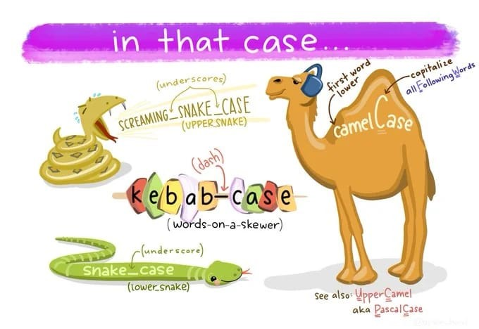

# Aula de Java

Esse repositório foi criado para armazenar os códigos das aulas de Java.

## Aulas

* **Primeira Aula**: [Sintaxe, Declaração de Variáveis, Loops](https://github.com/JaaumG/Aulas-Java/blob/main/src/main/java/dev/joaoguilherme/PrimeiraAula.java)
* **Segunda Aula**: [Math e String](https://github.com/JaaumG/Aulas-Java/blob/main/src/main/java/dev/joaoguilherme/SegundaAula.java)
* **Terceira Aula**: [Classes Wrapper](https://github.com/JaaumG/Aulas-Java/blob/main/src/main/java/dev/joaoguilherme/TerceiraAula.java)
* **Quarta Aula**: [Classes e Objetos](https://github.com/JaaumG/Aulas-Java/blob/main/src/main/java/dev/joaoguilherme/QuartaAula.java)
* **Quinta Aula**: [Métodos e Construtores](https://github.com/JaaumG/Aulas-Java/blob/main/src/main/java/dev/joaoguilherme/QuintaAula.java)
* **Sexta Aula**: [Acessibilidade, 'Getters' e 'Setters', Encapsulamento](https://github.com/JaaumG/Aulas-Java/blob/main/src/main/java/dev/joaoguilherme/sextaaula)
* **Sétima Aula**: [Herança e Sobrescrever Métodos](https://github.com/JaaumG/Aulas-Java/tree/main/src/main/java/dev/joaoguilherme/setimaaula)
* **Oitava Aula**: [Aprofundando na herança em Java](https://github.com/JaaumG/Aulas-Java/blob/main/src/main/java/dev/joaoguilherme/oitavaaula)
* **Nona Aula**: [Abstração, Classes abstratas, e interfaces](https://github.com/JaaumG/Aulas-Java/blob/main/src/main/java/dev/joaoguilherme/nonaaula)
* **Décima Aula**: [Interfaces e Polimorfismo](https://github.com/JaaumG/Aulas-Java/blob/main/src/main/java/dev/joaoguilherme/decimaaula)
* **Décima Primeira Aula**: [Tratamento de Exceções](https://github.com/JaaumG/Aulas-Java/blob/main/src/main/java/dev/joaoguilherme/decimaprimeiraaula)
* **Décima Segunda Aula**: [Assuntos não abordados](https://github.com/JaaumG/Aulas-Java/blob/main/src/main/java/dev/joaoguilherme/decimasegundaaula/README.md)
* **Décima Terceira Aula**: [Conexão com o banco de dados](https://github.com/JaaumG/Aulas-Java/blob/main/src/main/java/dev/joaoguilherme/decimaterceiraaula)

## Complementar

* **Dicionário**: [Link](https://github.com/JaaumG/Aulas-Java/blob/main/Dicionário%20de%20programação.md)
* **Estrutura de dados em Java**: [Link](https://github.com/JaaumG/Aulas-Java/blob/main/src/main/java/dev/joaoguilherme/EstruturaDeDadosEmJava.java)
* **Pilares da Programação Orientada a Objetos**: [Link](https://github.com/JaaumG/Aulas-Java/blob/main/src/main/java/dev/joaoguilherme/pilarespoo/README.md)

## Tipos de convenções de nomenclatura

### Principais convenções para Java
* camelCase: `nomeDeVariavel`, `nomeDeMetodo`
* PascalCase: `NomeDeClasse`, `NomeDeInterface`
* SCREAMING_SNAKE_CASE: `NOME_DE_ENUM`

