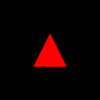

# Interfaces e Polimorfismo

Na aula anterior, vimos a definição de abstração, que nos permite definir um modelo de um objeto genérico, com suas características e comportamentos. Também vimos que uma classe é uma abstração de um objeto, e criar outros objetos mais específicos a partir dele.

Mas na grande maioria dos casos, é preferível a utilização de interfaces para definir um modelo de objeto através de seus comportamentos.

Por exemplo, temos um carro, um avião, e um barco, talvez você já tenha notado que os 3 são figuras
concretas de uma abstração de veículo, ou seja, todos são uma definição de veículo.

Mas no caso apesar de os 3 serem de fato um veículo eles não possuem atributos iguais como na analogia de pessoa da aula passada. Um carro tem rodas, barco não, um avião tem asas, carro e barco não, e assim por diante.

Entretanto, ao manusear um veículo temos ações que são de certa forma cabíveis em cada um deles. Por exemplo,
os três necessitam de combustíveis, os 3 possuem um motor que pode ser ligado e desligado, e assim por diante.

Nesse caso compensa mais agrupá-los a partir de suas mecânicas do que de suas características.
E para fazer isso utilizamos interfaces.

Mas aqui vale uma observação, tanto o barco, o carro e o avião, são veículos, indiferente de suas características, mecânicas individuais, formatos, tamanhos preços, etc.

Em outras palavras um veículo pode ser um carro, um barco, um avião, um jato, um helicóptero, ou seja, um veículo pode
assumir várias formas, e os gregos antigos tem uma palavra para definir esse comportamento, **polimorfismo**.

## Polimorfismo 

Polimorfismo é a capacidade de um objeto assumir várias formas, ou seja, um objeto pode ser de vários tipos, e
assumir vários comportamentos.

Poli - Muitos
Morfo - Formas

Polimorfismo - Muitas Formas

Nesta aula iremos ver uma forma de implementar e utilizar de uma interface em Java, para 
trabalhar com figuras geométricas, e utilizando do conceito de polimorfismo, para criar
uma lista de figuras geométricas, e calcular a área de cada uma delas.
