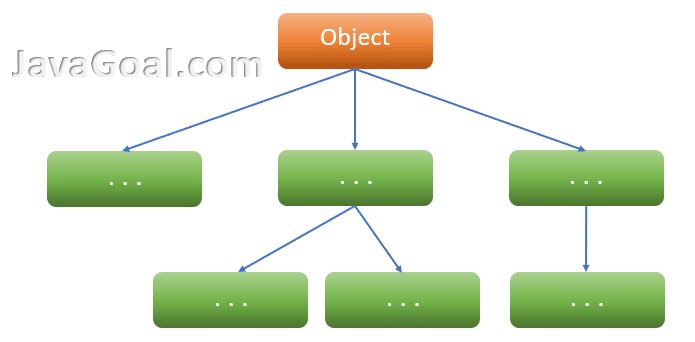

# Aprofundando em Herança

A herança em java, é um recurso que permite que uma classe herde atributos e métodos de outra classe. A classe que herda é chamada de subclasse, e a classe herdada é chamada de superclasse.

E dependedo da visibilidade do atributo ou método, a subclasse pode ou não acessar o atributo, ou método herdado.

Outra questão importante é em casos onde a classe filha e a classe pai possuem atributos com o mesmo nome, e a subclasse tenta acessar esse atributo, qual dos dois atributos será acessado?

Bom isso vai depender do modificador de acesso do atributo, se o atributo for privado, a subclasse não terá acesso a ele, e se o atributo for público, a subclasse terá acesso a ele.

Mas para que conseguimos especificar o atributo que queremos acessar temos duas palavras reservadas, o super e o this.

O this é utilizado para acessar o atributo da própria classe, e o super é utilizado para acessar o atributo da superclasse.

Vamos ver um exemplo:

````java
public class Pessoa {
    String nome;
    int idade;
    
    public Pessoa(String nome, int idade){
        this.nome = nome; //O this está se referindo a esta classe, ou seja, a classe Pessoa
        this.idade = idade;
    }
    
    public void imprimir(){
        System.out.println("Nome: " + this.nome);
        System.out.println("Idade: " + this.idade);
    }
}
````
````java
public class Aluno extends Pessoa {
    int matricula;
    
    public Aluno(String nome, int idade, int matricula){
        super(nome, idade); //O super está se referindo a superclasse, ou seja, a classe Pessoa
        this.matricula = matricula;
    }
    
    public void imprimir(){
        super.imprimir(); //O super está se referindo a superclasse, ou seja, a classe Pessoa
        System.out.println("Matricula: " + this.matricula);
    }
}
````

Outra questão importante é que uma classe pode herdar de apenas uma classe, ou seja, não é possível herdar de duas classes simultaneamente.
Entretanto, é possível ter uma sequência de herança, por exemplo, a classe A herda da classe B, e a classe B herda da classe C, e assim por diante.

Mas cuidado, pois se a classe C herdar da classe A, isso irá gerar um erro de compilação, pois a classe A já está herdando da classe B.

E no final, todas as classes herdam garantidamente a classe Object, seja por herança direta de forma implícita ou indiretamente herdando classe que herda de Object.



