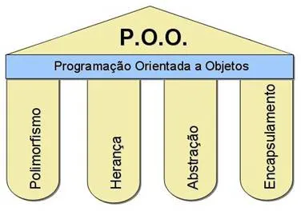

# Os pilares da Programação Orientada a Objetos (POO)

A orientação a objetos é um paradigma de programação que utiliza objetos em suas interações, para designar os objetos são utilizados nomes, atributos e métodos. Os objetos são instâncias de classes, que podem ser entendidas como um modelo de um objeto real. As classes são compostas por atributos, que são as características do objeto, e métodos, que são as ações que o objeto pode realizar.

Sendo um paradigma de programação, em outras palavras, um modelo de programação, a orientação a objetos não é uma linguagem de programação. Por isso, é possível programar orientado a objetos em diversas linguagens, como Java, C++, Python, etc.

A diferença entre a programação orientada a objetos e a programação estruturada é que na programação estruturada, o programa é dividido em funções (por exemplo, a linguagem C), enquanto na programação orientada a objetos, o programa é dividido em objetos.

Por fim é importante destacar que os pilares da Orientação a Objetos, são dependentes entre si, ou seja, não é possível utilizar um pilar sem utilizar os outros.
Polimorfismo só é possível por conta da herança e abstração, e a herança só é possível por conta da abstração, e assim por diante.

## Abstração
É a capacidade de abstrair um objeto real e transformá-lo em um objeto de software.
### Aulas:
* **Nona Aula**: [Abstração, Classes abstratas, e interfaces](https://github.com/JaaumG/Aulas-Java/blob/main/src/main/java/dev/joaoguilherme/nonaaula)

## Encapsulamento
É a capacidade de esconder partes independentes da implementação, permitindo construir partes invisíveis ao mundo exterior.
### Aulas:
* **Sexta Aula**: [Acessibilidade, 'Getters' e 'Setters', Encapsulamento](https://github.com/JaaumG/Aulas-Java/blob/main/src/main/java/dev/joaoguilherme/sextaaula)

## Herança
É a capacidade de criar classes a partir de outras já existentes.
### Aulas:
* **Sétima Aula**: [Herança e Sobrescrever Métodos](https://github.com/JaaumG/Aulas-Java/tree/main/src/main/java/dev/joaoguilherme/setimaaula)
* **Oitava Aula**: [Aprofundando na herança em Java](https://github.com/JaaumG/Aulas-Java/blob/main/src/main/java/dev/joaoguilherme/oitavaaula)

## Polimorfismo
É a capacidade de utilizar um método de diferentes formas para diferentes objetos.
### Aulas:
* **Décima Aula**: [Interfaces e Polimorfismo](https://github.com/JaaumG/Aulas-Java/blob/main/src/main/java/dev/joaoguilherme/decimaaula)

